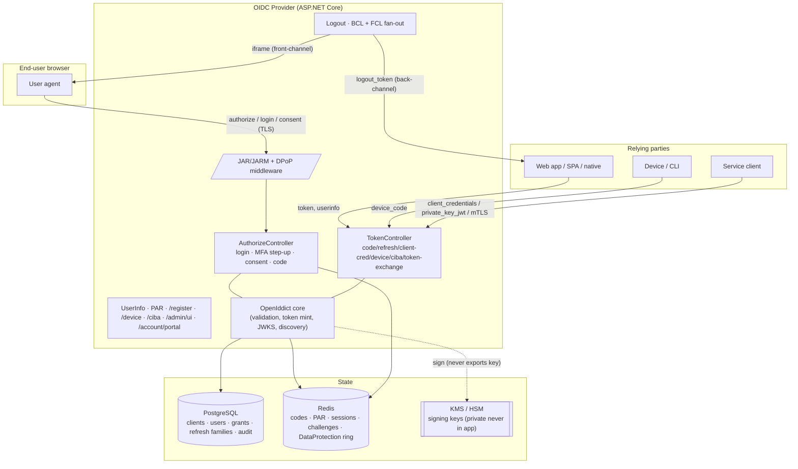
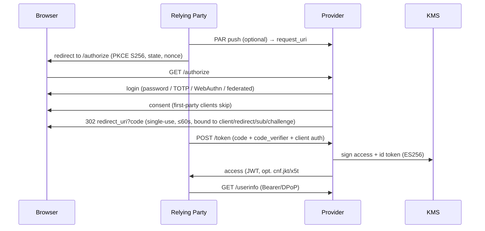

# Architecture

A standards-correct OAuth 2.1 / OpenID Connect provider built on **OpenIddict 6.4 / .NET 9**,
owning policy (users, MFA, consent, claims, keys) and delegating protocol mechanics to the
certified core. See the [ADRs](adr/) for the decisions; this is the component + flow view.

## Components & trust boundaries

Trust boundary: everything in **op** is the authorization server; private signing keys live only in
**KMS**. Browser↔OP and OP↔KMS/DB/Redis are the crossings to defend (TLS, network policy, the
threat model in [`threat-model.md`](threat-model.md)).

## Authorization-code + PKCE flow (the core path)

## Token & session model
- **Access tokens**: ES256 JWT, short TTL; optionally sender-constrained (DPoP `cnf.jkt` or mTLS
  `cnf.x5t#S256`); audience-restricted via Resource Indicators.
- **Refresh tokens**: opaque, reference-tracked, **rotating**; reuse of a rotated token revokes the
  whole family.
- **Sessions**: Redis, fresh `sid` per login (anti-fixation); `sid` → joined RP set drives logout
  fan-out; `auth_time` carried into the id_token.
- **Keys**: 3-state rotation (`next` published → `active` signs → `retired`) in KMS; JWKS publishes
  public keys only.

## Where to read the code
`app/src/OidcProvider.Api/Program.cs` wires the server; `Controllers/` hold the passthrough policy;
`OidcProvider.Core/Services/` hold the domain (PPID, consent, sessions, MFA, signing). The
design→code map is in [`../../app/README.md`](../../app/README.md).
