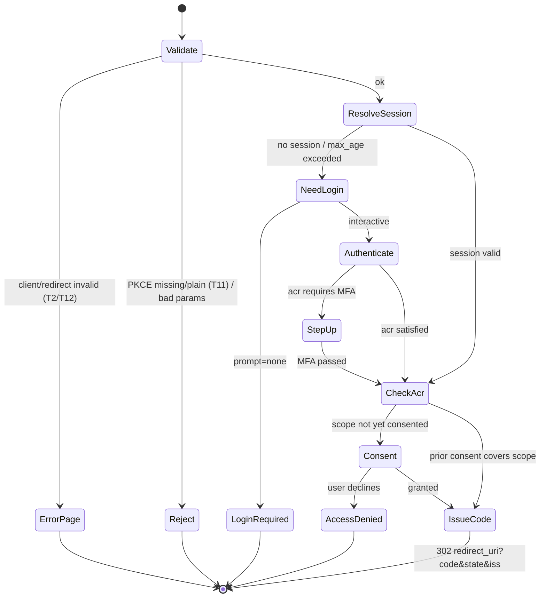

# Authorize Endpoint — Reference Controller

A fleshed-out ASP.NET Core controller for `/authorize`, realizing the pipeline in
[`component-authorize-endpoint.md`](./component-authorize-endpoint.md) on OpenIddict's
authorization-endpoint passthrough ([`openiddict-implementation.md`](./openiddict-implementation.md)).
Illustrative — pin to your OpenIddict version and harden per your stack. The point is the
**state machine**: validate → authenticate → step-up → consent → bind code, with each
transition mapping to a threat-model control.

## The state machine



## Controller

```csharp
using Microsoft.AspNetCore.Mvc;
using OpenIddict.Abstractions;
using OpenIddict.Server.AspNetCore;
using static OpenIddict.Abstractions.OpenIddictConstants;

[ApiController]
public sealed class AuthorizeController : Controller
{
    private readonly IUserSession _sessions;       // Redis-backed (ADR-0006)
    private readonly IUserStore _users;
    private readonly IMfaService _mfa;             // TOTP / WebAuthn
    private readonly IConsentStore _consents;
    private readonly IPairwiseSubjects _ppid;      // ADR-0010
    private readonly IClientStore _clients;

    public AuthorizeController(IUserSession s, IUserStore u, IMfaService m,
        IConsentStore c, IPairwiseSubjects p, IClientStore cl)
        => (_sessions, _users, _mfa, _consents, _ppid, _clients)
           = (s, u, m, c, p, cl);

    // OpenIddict has already parsed + did baseline validation (PKCE presence,
    // response_type, exact redirect_uri match) BEFORE passthrough hands to us.
    [HttpGet("/authorize"), HttpPost("/authorize")]
    [IgnoreAntiforgeryToken]
    public async Task<IActionResult> Authorize()
    {
        var request = HttpContext.GetOpenIddictServerRequest()
            ?? throw new InvalidOperationException("Not an OpenID Connect request.");

        // --- belt-and-braces: enforce S256 ourselves too (ADR-0011, T11) ---
        if (request.CodeChallenge is null ||
            request.CodeChallengeMethod != CodeChallengeMethods.Sha256)
        {
            return Forbid(
                authenticationSchemes: OpenIddictServerAspNetCoreDefaults.AuthenticationScheme,
                properties: Error(Errors.InvalidRequest,
                    "PKCE with S256 is required."));
        }

        // --- ResolveSession: existing auth + max_age (component step 4) ---
        var session = await _sessions.GetAsync(HttpContext);
        var mustReauth = session is null ||
            (request.MaxAge is long maxAge &&
             session.AuthTime < DateTimeOffset.UtcNow.AddSeconds(-maxAge));
        var promptNone = request.HasPrompt(Prompts.Login) == false &&
                         request.HasPrompt(Prompts.None);

        if (mustReauth && promptNone)
            return Forbid(OpenIddictServerAspNetCoreDefaults.AuthenticationScheme,
                Error(Errors.LoginRequired, "Interactive login required."));

        if (mustReauth || request.HasPrompt(Prompts.Login))
            return Challenge(  // hands off to the login UI; returns here after
                authenticationSchemes: "Cookies",
                properties: new() { RedirectUri = Request.GetEncodedPathAndQuery() });

        var user = await _users.GetAsync(session!.UserId);

        // --- StepUp: satisfy requested acr (e.g. MFA) (component step 5) ---
        var requiredAcr = AcrPolicy.Resolve(request.GetAcrValues(), user, session);
        if (!session.SatisfiesAcr(requiredAcr))
        {
            if (promptNone)
                return Forbid(OpenIddictServerAspNetCoreDefaults.AuthenticationScheme,
                    Error(Errors.LoginRequired, "Step-up authentication required."));
            return RedirectToAction("StepUp", "Mfa",
                new { returnUrl = Request.GetEncodedPathAndQuery(), acr = requiredAcr });
        }

        // --- Consent: prior consent or interactive (component step 6) ---
        var requested = request.GetScopes();
        var consent = await _consents.GetActiveAsync(user.Id, request.ClientId!);
        var covered = consent is not null &&
                      requested.All(s => consent.Scopes.Contains(s));

        if (!covered)
        {
            if (promptNone)
                return Forbid(OpenIddictServerAspNetCoreDefaults.AuthenticationScheme,
                    Error(Errors.ConsentRequired, "User consent required."));
            if (Request.Method == HttpMethods.Get) // first pass → show the screen
                return View("Consent", await ConsentVm(request, user));
            if (Request.Form["submit"] != "accept") // user declined (T8)
                return Forbid(OpenIddictServerAspNetCoreDefaults.AuthenticationScheme,
                    Error(Errors.AccessDenied, "User denied consent."));
            await _consents.RecordAsync(user.Id, request.ClientId!, requested);
        }

        // --- IssueCode: build the principal OpenIddict mints the code from ---
        var client = await _clients.GetAsync(request.ClientId!);
        var identity = new ClaimsIdentity(
            OpenIddictServerAspNetCoreDefaults.AuthenticationScheme,
            Claims.Name, Claims.Role);

        // ADR-0010: pairwise PPID, never the raw user id
        identity.SetClaim(Claims.Subject,
            await _ppid.ForAsync(user.Id, client.SectorIdentifier ?? client.ClientId));
        identity.SetClaim("acr", session.Acr);
        identity.SetClaims("amr", session.Amr.ToImmutableArray());
        identity.SetScopes(requested);
        identity.SetClaim(Claims.Email, user.Email);
        identity.SetClaim(Claims.EmailVerified, user.EmailVerified.ToString());
        identity.SetDestinations(GetDestinations);

        // OpenIddict now: binds nonce, computes at_hash, mints the single-use
        // code bound to {client, redirect_uri, code_challenge, sub, scope},
        // stores it (≤60s TTL), and 302s to redirect_uri with code+state+iss.
        return SignIn(new ClaimsPrincipal(identity),
            OpenIddictServerAspNetCoreDefaults.AuthenticationScheme);
    }

    // Which claims land in the id_token vs the access token.
    private static IEnumerable<string> GetDestinations(Claim claim) => claim.Type switch
    {
        Claims.Name or Claims.Email or Claims.EmailVerified
            => new[] { Destinations.IdentityToken },          // userinfo + id_token
        "acr" or "amr"
            => new[] { Destinations.IdentityToken, Destinations.AccessToken },
        _   => new[] { Destinations.AccessToken },
    };

    private static AuthenticationProperties Error(string error, string desc) => new(
        new Dictionary<string, string?>
        {
            [OpenIddictServerAspNetCoreConstants.Properties.Error] = error,
            [OpenIddictServerAspNetCoreConstants.Properties.ErrorDescription] = desc,
        });
}
```

## How each transition maps to a control

| State / line | Control | Threat | Test |
|---|---|---|---|
| OpenIddict pre-validation (exact `redirect_uri`, `response_type=code`) | error page, no redirect for bad client/redirect | T2, T12 | AC-T2-1..4 |
| `CodeChallenge`/`S256` guard | PKCE mandatory, `plain` rejected | T11 | AC-T11-1..2 |
| `mustReauth && promptNone` → `login_required` | no silent auth without a session | — | conformance |
| `Challenge("Cookies")` + session rotation in login | anti-fixation (rotate id on login) | T13 | AC-T13-1 |
| `SatisfiesAcr` step-up | enforce requested `acr` (MFA) | — | conformance |
| Consent screen + decline path | first-party consent, no auto-grant | T8 | AC-T8-2..3 |
| `SetClaim(Subject, ppid)` | pairwise subject | — (privacy) | — |
| `SignIn(...)` → OpenIddict code mint | single-use ≤60s code bound to params | T1 | AC-T1-1..3 |
| `GetDestinations` | least-claims-per-token | info disclosure | — |

## Login + MFA actions (sketch)

The `Challenge("Cookies")` returns to a login controller that, on success, **rotates the
session id** (T13) and writes `AuthTime`/`Acr`/`Amr` into the Redis-backed session, then
redirects back to `/authorize` — which now finds a valid session and proceeds. The MFA
`StepUp` action verifies TOTP/WebAuthn (checking the WebAuthn `sign_count` for clone
detection — see [`schema.sql`](./schema.sql) `user_mfa_methods`), raises the session's
`acr`/`amr`, and returns to `/authorize`. Both are deliberately *outside* the
authorization controller so the protocol logic stays free of credential handling.

## Notes

- `[IgnoreAntiforgeryToken]` on `/authorize` is intentional — CSRF defense here is the
  mandatory `state` parameter (T5), not a form token; the **consent POST** must still
  carry its own antiforgery token.
- Every error path uses `Forbid(...)` with OpenIddict error properties so the response is
  a spec-correct redirect (or page) — never a partial success.
- The controller holds **no** signing keys and never touches refresh tokens; issuance and
  KMS signing happen inside OpenIddict after `SignIn` (ADR-0004/0005).
