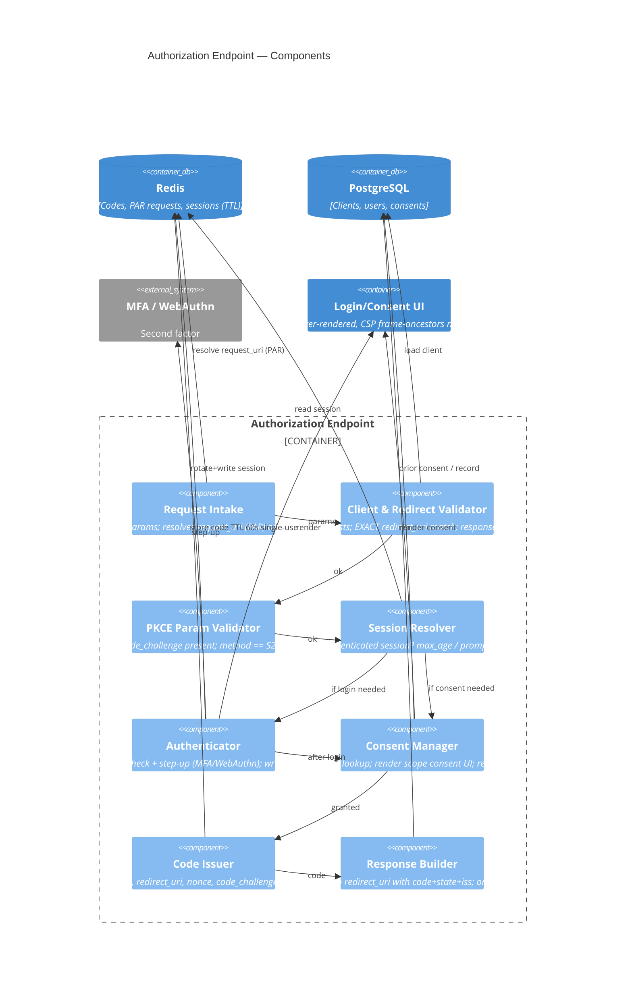

# C4 Component — Authorization Endpoint

`GET/POST /authorize` (and its back-channel sibling `POST /par`) is where the user is
authenticated and consent is captured, and where an authorization code is bound to a
client, `redirect_uri`, PKCE challenge, and session. It is the front-channel surface —
its inputs arrive through the untrusted user-agent — so most of its work is *validation
before any UI is shown* and *binding before any code is issued*. Companion:
[`component-token-endpoint.md`](./component-token-endpoint.md).

## Component diagram

## Component responsibilities

| Component | Responsibility | Key validations | Failure mode |
|---|---|---|---|
| Request Intake | Parse params; resolve PAR `request_uri` / signed `request` object | `request_uri` valid+unexpired+single-use; JAR signature valid | `invalid_request_uri` / `invalid_request_object` |
| Client & Redirect Validator | Authenticate the *request* shape | `client_id` registered; **exact** `redirect_uri`; `response_type=code` | **No redirect** if client/redirect invalid → error page |
| PKCE Param Validator | Enforce PKCE up front | `code_challenge` present; `code_challenge_method == S256` | `invalid_request` (redirect) |
| Session Resolver | Decide if login is needed | evaluate `prompt`, `max_age`, existing session freshness | `login_required` if `prompt=none` and no session |
| Authenticator | Establish/raise auth level | credential + step-up; satisfy `acr_values`; **rotate session id** | `access_denied` / re-prompt |
| Consent Manager | Capture scope consent | prior consent covers requested scope? else render UI | `access_denied` / `consent_required` |
| Code Issuer | Bind + mint the code | bind all parameters atomically; single-use; ≤60s TTL | 500 fail-closed |
| Response Builder | Return result | include `iss` (mix-up defense) + `state`; `no-store` | redirect with error params |

## Pipeline narrative — `response_type=code`

1. **Request Intake** parses parameters. If `request_uri` is present, it fetches the
   pushed request from Redis (PAR — [`adr/0009`](./adr/0009-sender-constraining.md)),
   asserting it is unexpired and single-use; if a signed `request` object (JAR) is
   present, its signature/`aud` are verified. Pushed/signed params **override** query
   params and can't be tampered with in the URL.
2. **Client & Redirect Validator** loads the client, checks `response_type=code`, and
   does the **byte-exact `redirect_uri` match**. *If the client or redirect URI is
   invalid, we render an error page and NEVER redirect* (else we'd become an open
   redirect — threat T2/T12).
3. **PKCE Param Validator** requires `code_challenge` and `code_challenge_method=S256`.
   Absent or `plain` ⇒ `invalid_request` (threat T11). *(non-negotiable)*
4. **Session Resolver** evaluates `prompt` and `max_age` against any existing session.
   `prompt=none` + no usable session ⇒ `login_required` returned to the client without UI.
5. **Authenticator** (if needed) runs credentials + step-up (MFA/WebAuthn) to satisfy
   `acr_values`, **rotates the session id** (anti-fixation — T13), and records `acr`/`amr`.
6. **Consent Manager** checks stored consent; if the requested scope isn't already
   granted, it renders the first-party consent UI (CSP `frame-ancestors 'none'` — T14)
   and records the decision. Decline ⇒ `access_denied`.
7. **Code Issuer** mints an authorization code and **atomically binds** it to
   `{client_id, redirect_uri, nonce, code_challenge, sub (pairwise), acr/amr, scope,
   session}` with a ≤60s single-use TTL in Redis ([`adr/0006`](./adr/0006-storage-split.md)).
8. **Response Builder** issues `302` to the exact `redirect_uri` with `code`, the echoed
   `state`, and **`iss`** (mix-up defense — T2), under `Cache-Control: no-store`.

## Why the order matters

Validation is strictly **cheapest-and-most-decisive first**: client/redirect validity
gates everything (it decides whether we may even redirect errors), PKCE is enforced
before any UI, and the code is bound only after both authentication *and* consent
succeed. Every binding placed on the code here is what the
[token endpoint](./component-token-endpoint.md) re-checks at redemption — the two
endpoints are two halves of one contract.
