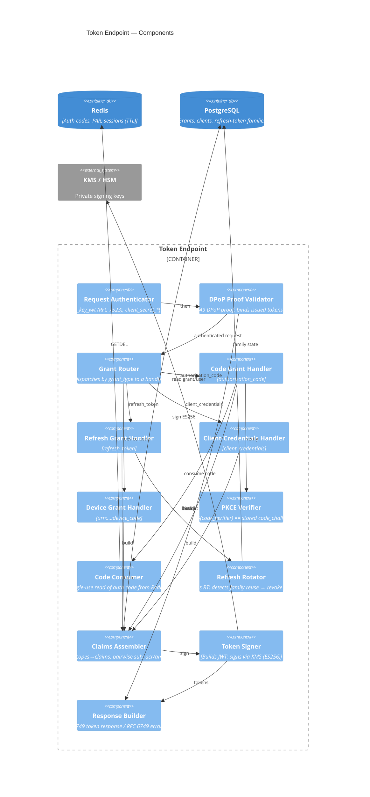

# C4 Component — Token Endpoint

`POST /token` is the most security-critical surface in the provider: it converts proofs
of prior authorization (an authorization code, a refresh token, a client assertion) into
issued tokens. Every grant type funnels through one authentication + validation pipeline
before any token is minted. This document decomposes the container into components.

## Component diagram

## Component responsibilities

| Component | Responsibility | Key validations | Failure → error |
|---|---|---|---|
| Request Authenticator | Authenticate the client | `private_key_jwt`: verify sig, `aud`=token endpoint, `exp`, `jti` not replayed; secret: constant-time compare | `invalid_client` (401) |
| DPoP Proof Validator | Validate DPoP proof, derive `jkt` | `htm`/`htu` match, `iat` fresh, `jti` unreplayed, key matches bound token | `invalid_dpop_proof` / `invalid_token` (400/401) |
| Grant Router | Dispatch by `grant_type` | grant_type registered for this client | `unsupported_grant_type` / `unauthorized_client` (400) |
| Code Grant Handler | Exchange auth code | code exists, not expired, bound to this client + `redirect_uri` | `invalid_grant` (400) |
| Code Consumer | Single-use code read | atomic `GETDEL`; absent ⇒ replay/expired | `invalid_grant` (400) |
| PKCE Verifier | Enforce PKCE | `S256(code_verifier) == code_challenge`; method must be S256 | `invalid_grant` (400) |
| Refresh Grant Handler | Exchange refresh token | token active, not rotated-out | `invalid_grant` (400) |
| Refresh Rotator | Rotate + reuse-detect | rotated-out token presented ⇒ **revoke family** | `invalid_grant` (400) + family revoke |
| Client-Credentials Handler | Machine-to-machine | client allowed, requested scope ⊆ client scope | `invalid_scope` (400) |
| Device Grant Handler | Poll device code | code approved? else `authorization_pending`/`slow_down` | `authorization_pending` (400) |
| Claims Assembler | scopes→claims, pairwise `sub`, `at_hash`, `acr`/`amr` | scope grant present; audience correct | `invalid_scope` (400) |
| Token Signer | Build + sign JWT via KMS | correct `kid`, alg pinned ES256, `iss`/`aud`/`exp` set | 500 (fail closed) |
| Response Builder | Emit token or error JSON | no token in error path; `Cache-Control: no-store` | — |

## Pipeline narrative — `grant_type=authorization_code`

1. **Request Authenticator** authenticates the client (asymmetric assertion preferred per
   [ADR-0008](./adr/0008-client-authentication.md)). Public clients carry no secret —
   PKCE is the proof. Failure ⇒ `invalid_client`.
2. **DPoP Proof Validator** (if a `DPoP` header is present, or required for this client)
   validates the proof and derives the confirmation key `jkt` to bind into the tokens.
3. **Grant Router** confirms `authorization_code` is permitted for the client and
   dispatches to the **Code Grant Handler**.
4. **Code Consumer** does an **atomic single-use** fetch of the code from Redis
   (`GETDEL`). A miss means already-used or expired ⇒ `invalid_grant`. *(non-negotiable)*
5. The handler checks the **`redirect_uri` is byte-for-byte the one bound to the code**
   ⇒ else `invalid_grant`. *(non-negotiable — no substring/wildcard)*
6. **PKCE Verifier** recomputes `S256(code_verifier)` and compares to the stored
   `code_challenge`; mismatch ⇒ `invalid_grant`. *(non-negotiable)*
7. **Claims Assembler** loads the grant, resolves granted scopes to claims, computes the
   **pairwise `sub`** ([ADR-0010](./adr/0010-pairwise-subject-identifiers.md)), sets
   `nonce`, `acr`/`amr`, and `at_hash` for the ID token.
8. **Token Signer** builds the access-token JWT and ID-token JWT and signs each via the
   **KMS** ([ADR-0005](./adr/0005-key-custody.md)) using the active `kid`, alg pinned to
   ES256. A fresh **opaque** refresh token is created and its family row persisted.
9. **Response Builder** returns `{access_token, id_token, refresh_token, token_type,
   expires_in}` with `Cache-Control: no-store`. On any failure above, it returns the RFC
   6749 error JSON and **never** a partial token.

## Extension points

- **DPoP / mTLS sender-constraining** — the DPoP Proof Validator is the single insertion
  point; the same `cnf`/`jkt` binding flows into the Token Signer
  ([ADR-0009](./adr/0009-sender-constraining.md)).
- **PAR (RFC 9126)** — lands on the authorize side; the token endpoint only sees its
  effect (a code bound to a pushed, tamper-proof request).
- **Token Exchange (RFC 8693)** — added as an additional Grant Handler behind the same
  Request Authenticator, for delegation/impersonation use cases.
