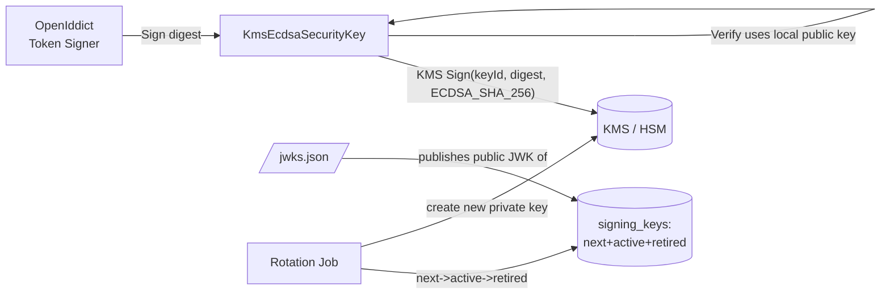

# KMS Signing Adapter & Key Rotation

The one piece of custom cryptographic plumbing the whole design assumes
([`adr/0005`](./adr/0005-key-custody.md)): a `SecurityKey` whose **private operation is a
remote KMS call** so private key material never enters the process, plus the **3-state
rotation job** (`next` → `active` → `retired`) that makes [`/jwks.json`](./endpoint-spec.md)
publish keys verifiers can prefetch — giving zero-downtime rotation. Illustrative C#
(AWS KMS shown; the seam is provider-agnostic — swap for Azure Key Vault / GCP KMS /
PKCS#11 HSM).

## How it fits



OpenIddict asks the configured `SigningCredentials` to sign the token's signing input; our
key forwards the hash to the KMS and returns the signature. Only **public** keys are ever
held locally (for JWKS publication and signature verification on the validation side).

## 1. The KMS-backed ECDSA security key

```csharp
using System.Security.Cryptography;
using Amazon.KeyManagementService;
using Amazon.KeyManagementService.Model;
using Microsoft.IdentityModel.Tokens;

/// An ECDsa SecurityKey whose private Sign is delegated to a KMS.
/// The private key NEVER exists in this process (ADR-0005).
public sealed class KmsEcdsaSecurityKey : ECDsaSecurityKey
{
    private readonly IAmazonKeyManagementService _kms;
    private readonly string _kmsKeyId;

    // Base ECDsaSecurityKey holds ONLY the public key (for verify + JWKS).
    public KmsEcdsaSecurityKey(ECDsa publicOnly, string kid, string kmsKeyId,
                               IAmazonKeyManagementService kms) : base(publicOnly)
    {
        KeyId = kid;                 // becomes the JWKS "kid"
        _kmsKeyId = kmsKeyId;
        _kms = kms;
    }

    public string KmsKeyId => _kmsKeyId;
}

/// Wires KMS signing into the WS-* / JWT crypto pipeline.
public sealed class KmsCryptoProvider : ICryptoProvider
{
    private readonly IAmazonKeyManagementService _kms;
    public KmsCryptoProvider(IAmazonKeyManagementService kms) => _kms = kms;

    public bool IsSupportedAlgorithm(string algorithm, params object[] args)
        => algorithm == SecurityAlgorithms.EcdsaSha256
           && args is [KmsEcdsaSecurityKey, ..];

    public object Create(string algorithm, params object[] args)
        => new KmsSignatureProvider((KmsEcdsaSecurityKey)args[0], algorithm, _kms);

    public void Release(object cryptoInstance)
        => (cryptoInstance as IDisposable)?.Dispose();
}

/// The actual sign-via-KMS / verify-locally provider.
public sealed class KmsSignatureProvider : SignatureProvider
{
    private readonly KmsEcdsaSecurityKey _key;
    private readonly IAmazonKeyManagementService _kms;

    public KmsSignatureProvider(KmsEcdsaSecurityKey key, string alg,
        IAmazonKeyManagementService kms) : base(key, alg) { _key = key; _kms = kms; }

    // SIGN: hash locally, send the 32-byte digest to KMS, return the signature.
    public override byte[] Sign(byte[] input)
    {
        var digest = SHA256.HashData(input);
        var resp = _kms.SignAsync(new SignRequest
        {
            KeyId            = _key.KmsKeyId,
            Message          = new MemoryStream(digest),
            MessageType      = MessageType.DIGEST,
            SigningAlgorithm = SigningAlgorithmSpec.ECDSA_SHA_256,
        }).GetAwaiter().GetResult();

        // KMS returns DER; JOSE/JWT wants raw R||S (P1363). Convert.
        return DerToConcat(resp.Signature.ToArray(), 32);
    }

    // VERIFY: local, with the public key — no KMS call, blocks alg confusion (T9).
    public override bool Verify(byte[] input, byte[] signature)
    {
        using var ecdsa = _key.ECDsa;
        return ecdsa.VerifyData(input, signature, HashAlgorithmName.SHA256,
                                DSASignatureFormat.IeeeP1363FixedFieldConcatenation);
    }

    protected override void Dispose(bool disposing) { }

    private static byte[] DerToConcat(byte[] der, int coordLen)
    {
        // Minimal DER SEQUENCE{ INTEGER r, INTEGER s } -> fixed R||S.
        // Use a vetted ASN.1 reader (System.Formats.Asn1) in production.
        var reader = new System.Formats.Asn1.AsnReader(der,
            System.Formats.Asn1.AsnEncodingRules.DER).ReadSequence();
        var r = reader.ReadInteger();
        var s = reader.ReadInteger();
        var outp = new byte[coordLen * 2];
        WriteFixed(r, outp.AsSpan(0, coordLen));
        WriteFixed(s, outp.AsSpan(coordLen, coordLen));
        return outp;

        static void WriteFixed(System.Numerics.BigInteger v, Span<byte> dst)
        {
            var b = v.ToByteArray(isUnsigned: true, isBigEndian: true);
            b.AsSpan().CopyTo(dst[(dst.Length - b.Length)..]);
        }
    }
}
```

> The two non-negotiables here: **`Sign` never sees a private key** (only a digest goes
> out, only a signature comes back), and **`Verify` is local + algorithm-pinned**, so the
> validation path can't be tricked into `alg:none` or RS↔HS confusion (threat T9).

## 2. Registering the keys with OpenIddict

Load all three lifecycle keys at startup so `next` is published in JWKS *before* it signs:

```csharp
public static async Task AddKmsSigningAsync(this OpenIddictServerBuilder o,
    ISigningKeyStore store, IAmazonKeyManagementService kms)
{
    CryptoProviderFactory.Default.CustomCryptoProvider = new KmsCryptoProvider(kms);

    foreach (var k in await store.GetPublishableAsync()) // next + active + retired-unexpired
    {
        var pub = ECDsa.Create();
        pub.ImportSubjectPublicKeyInfo(k.PublicKeyDer, out _);
        var key = new KmsEcdsaSecurityKey(pub, k.Kid, k.KmsKeyRef, kms);

        // Only the ACTIVE key signs; the rest are published for verification only.
        if (k.Status == KeyStatus.Active)
            o.AddSigningKey(key);
        o.AddEncryptionKey(key); // or expose via JWKS document directly
    }
}
```

OpenIddict serves every registered key's public JWK at `/jwks.json`, so verifiers see the
`next` key ahead of activation ([`endpoint-spec.md`](./endpoint-spec.md)).

## 3. The 3-state rotation job

Runs on a schedule (e.g. weekly) and on demand. Persists to `signing_keys`
([`schema.sql`](./schema.sql)); the partial unique index `uq_signing_one_active` guarantees
at most one `active` key, so the promotion step is safe under concurrency.

```csharp
public sealed class KeyRotationJob
{
    private readonly ISigningKeyStore _store;
    private readonly IAmazonKeyManagementService _kms;

    // Invariant timeline per key:  created → next → active → retired → deleted(after TTL)
    public async Task RotateAsync()
    {
        // 1. Ensure a `next` exists, published ahead of time. If absent, mint one in KMS.
        if (await _store.GetByStatusAsync(KeyStatus.Next) is null)
        {
            var created = await _kms.CreateKeyAsync(new() {
                KeySpec = KeySpec.ECC_NIST_P256, KeyUsage = KeyUsageType.SIGN_VERIFY });
            var pub = await _kms.GetPublicKeyAsync(new() { KeyId = created.KeyMetadata.KeyId });
            await _store.InsertAsync(new SigningKey {
                Kid = NewKid(), Alg = "ES256",
                KmsKeyRef = created.KeyMetadata.KeyId,
                PublicKeyDer = pub.PublicKey.ToArray(),
                Status = KeyStatus.Next,
                NotBefore = DateTimeOffset.UtcNow.AddMinutes(propagationWindow) });
            return; // publish `next` now; promote on a later run after propagation
        }

        var next = await _store.GetByStatusAsync(KeyStatus.Next);
        if (next!.NotBefore > DateTimeOffset.UtcNow) return; // let verifiers cache it first

        // 2. Promote in one transaction (index enforces single active):
        //    active → retired (kept in JWKS until its tokens expire),
        //    next   → active.
        await _store.PromoteAsync(retire: KeyStatus.Active, activate: next.Kid);

        // 3. Retire-and-purge: drop retired keys past max access-token lifetime
        //    from JWKS, and schedule KMS key deletion well after.
        await _store.PurgeExpiredRetiredAsync(olderThan: maxAccessTokenLifetime);

        await _audit.WriteAsync("key.rotated", new { activated = next.Kid });
    }
}
```

### Why this ordering is safe

1. A new key is born `next` and **published in JWKS immediately**, but does not sign.
2. After a propagation window (longer than the JWKS cache TTL), it is promoted to `active`
   and starts signing — every verifier already has its public half, so **no token is ever
   signed by a key a verifier hasn't seen**.
3. The old key becomes `retired`: it no longer signs but **stays in JWKS** until every
   token it signed has expired, so in-flight tokens still verify.
4. Only then is it removed from JWKS and, later still, deleted in the KMS.

This is the mechanism behind abuse-test **AC-T7-2** (rotate, both old and new tokens
verify, zero downtime) and **AC-T10-2** (`next` key present in JWKS before activation).

## 4. Operational notes

- **Latency:** every issuance is one KMS `Sign` round trip. Co-locate the KMS region;
  consider a small signing concurrency pool. The token endpoint is the hot path — load-test
  it (delivery-plan §testing, threat T15).
- **Availability:** KMS is now on the critical path. Use a multi-region/HA KMS or HSM;
  **fail closed** (refuse to issue) rather than fall back to a local key.
- **Compromise drill (AC-T7-1):** because the process never holds the private key, a full
  memory dump yields nothing signable — verify this in CI.
- **Emergency rotation:** the same job, invoked on demand, promotes `next` immediately and
  marks the suspected `active` key `retired` + revokes outstanding grants if warranted.
- **Provider swap:** only `KmsSignatureProvider.Sign` and the `CreateKey`/`GetPublicKey`
  calls in the job are AWS-specific — re-implement those two seams for Azure Key Vault,
  GCP KMS, or a PKCS#11 HSM.
