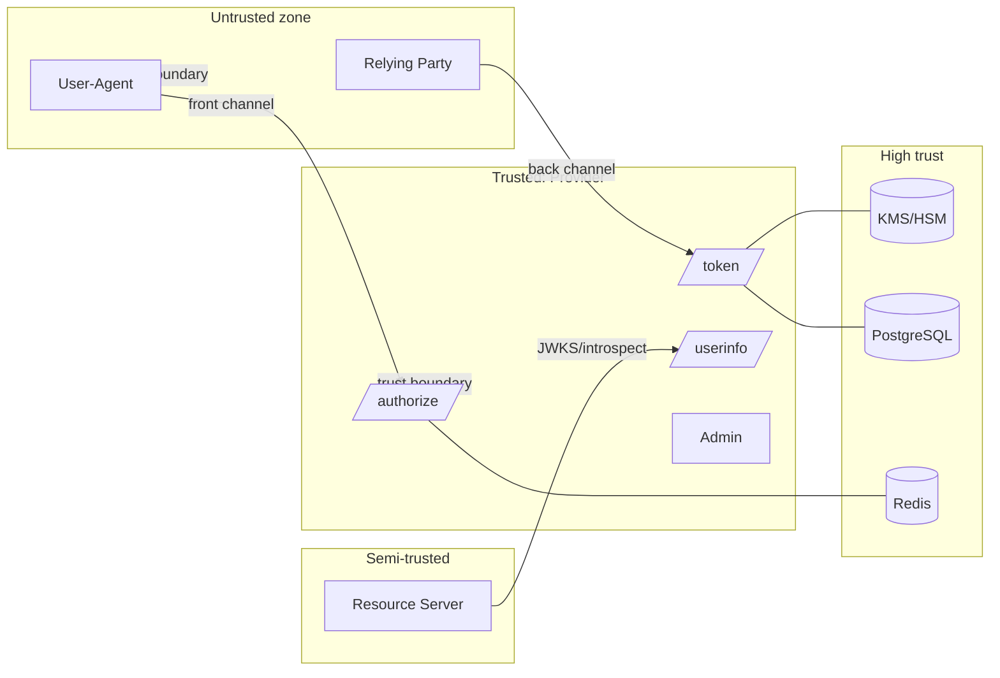
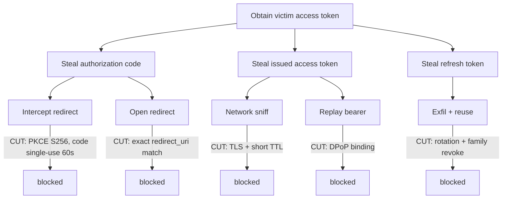
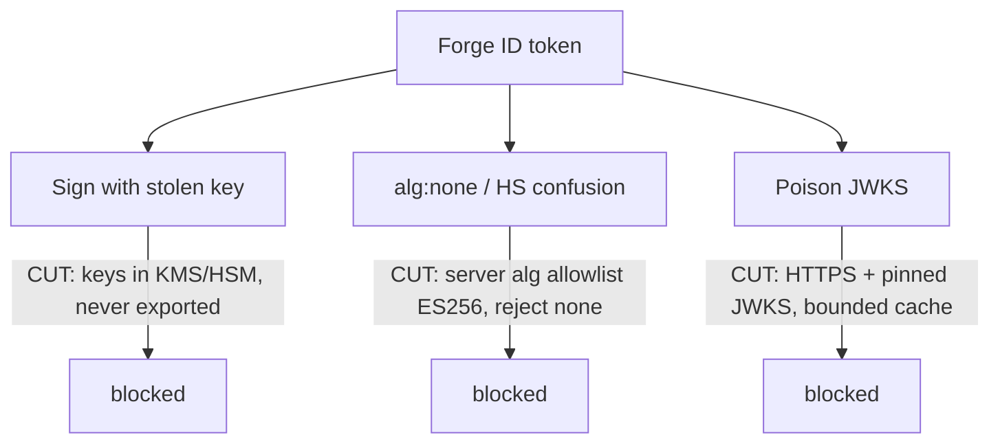
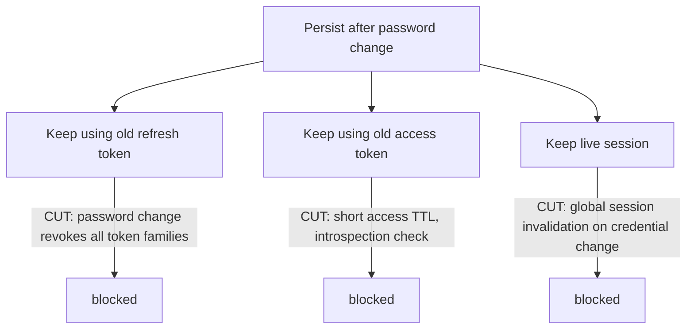

# Threat Model — OIDC Provider

STRIDE-based, grounded in **RFC 9700 (OAuth 2.0 Security BCP)** and the OIDC security
considerations. Each threat ties to a concrete, implementable control. Companion:
[`endpoint-spec.md`](./endpoint-spec.md), [`adr/README.md`](./adr/README.md).

## 1. Assumptions & trust boundaries

- **User-agent (browser/native app):** untrusted transport; subject to XSS, phishing,
  malicious extensions, shared device.
- **Relying Party (client):** semi-trusted; public clients hold no secret; may be
  malicious or compromised.
- **Resource server:** validates tokens via JWKS/introspection; trusts our `iss`.
- **Provider services** (`/authorize`, `/token`, `/userinfo`, admin): trusted, but the
  front channel passes through the untrusted user-agent.
- **KMS/HSM:** highest-trust; private keys never leave it ([ADR-0005](./adr/0005-key-custody.md)).
- **Datastores:** Redis (ephemeral, security-sensitive), Postgres (durable). Trusted
  network, encrypted in transit + at rest.

## 2. STRIDE threats → mitigations

| # | Threat (STRIDE) | Attack vector | Impact | Structural mitigation |
|---|---|---|---|---|
| T1 | Information disclosure | **Authorization code interception** (referer, history, network) | Token theft | Mandatory **PKCE S256**; codes single-use, ≤60s ([ADR-0006](./adr/0006-storage-split.md)) |
| T2 | Tampering/Spoofing | **Open redirect / mix-up** (attacker-controlled `redirect_uri`, ambiguous issuer) | Code/token exfil, RP confusion | **Exact** `redirect_uri` match; `iss` in authz response; per-AS distinct redirect URIs |
| T3 | Spoofing | **Access token replay** (stolen bearer reused) | Impersonation | Short TTL (5–15m) + **DPoP** sender-constraining ([ADR-0009](./adr/0009-sender-constraining.md)) |
| T4 | Elevation/Spoofing | **Refresh token theft** | Persistent access | **Rotation + family reuse detection** ([ADR-0007](./adr/0007-refresh-token-rotation.md)); DPoP-bind RTs |
| T5 | Tampering | **CSRF on callback** (forged authz response) | Login CSRF / session fixation | Mandatory `state` bound to user session; reject unbound responses |
| T6 | Spoofing | **ID token replay** | Auth bypass at RP | `nonce` binding; `at_hash`/`c_hash`; `aud`/`iss`/`exp` checks |
| T7 | Tampering | **Signing key compromise** | Total — mint any token | Keys in **KMS/HSM only**; rotation; `next` key pre-publish ([ADR-0005](./adr/0005-key-custody.md)) |
| T8 | Spoofing | **Consent phishing / malicious client** | User grants attacker scope | First-party consent UI; client vetting; clear scope display; gated registration |
| T9 | Tampering | **JWT alg confusion** (`alg:none`, RS↔HS swap) | Forged tokens accepted | **Server-side alg allowlist** (ES256 only); reject `none`; never key-type-confuse |
| T10 | Tampering | **JWKS poisoning** (MITM/cache poisoning of `jwks_uri`) | Forged-token acceptance | HTTPS + cert pinning to JWKS; signed metadata; bounded cache TTL |
| T11 | Elevation | **PKCE downgrade** (`plain`, or stripped challenge) | Code interception re-enabled | Accept **only `S256`**; require `code_challenge` always; reject if absent |
| T12 | Tampering | **`redirect_uri` manipulation** (path/param injection, substring match) | Code exfil | Byte-exact match; no wildcards; normalize before compare |
| T13 | Spoofing | **Session fixation** | Victim uses attacker session | Rotate session id on login; bind code to authenticated session |
| T14 | Tampering | **Clickjacking** of consent/login UI | Unintended consent | `X-Frame-Options: DENY` / CSP `frame-ancestors 'none'`; no auth UI in iframes |
| T15 | Denial of service | **Flood `/token` or `/par`** | Outage | Per-client + per-IP rate limits; PAR request TTL; bounded request-object size; WAF |
| T16 | Repudiation | **Action without audit trail** | Cannot investigate | Tamper-evident audit log of issuance/consent/revocation; KMS signing audit |

## 3. Attack trees

### (a) Goal: obtain a valid access token for the victim

### (b) Goal: forge an ID token

### (c) Goal: persist access after the victim changes password

## 4. Mitigations → controls mapping

| Control | Neutralizes | Where enforced |
|---|---|---|
| Mandatory **PKCE S256** (reject `plain`/absent) | T1, T11 | `/authorize`, `/token` PKCE Verifier |
| **Exact `redirect_uri`** matching | T2, T12 | `/authorize`, Code Grant Handler |
| Short-lived **single-use codes** (`GETDEL`) | T1 | Redis + Code Consumer |
| **Refresh rotation + family revocation** | T4, (c) | Refresh Rotator + Postgres |
| **DPoP** sender-constraining | T3, T4 | DPoP Proof Validator, Token Signer |
| **Server-side alg allowlist** (ES256; no `none`/HS) | T6, T9 | Token validation + verification config |
| **KMS/HSM key custody** + rotation + `next` pre-publish | T7, (b) | Key Management, `/jwks.json` |
| **`iss`** in authz response | T2 | `/authorize` response builder |
| **`state` + `nonce`** binding | T5, T6, T13 | `/authorize`, RP contract |
| **CSP `frame-ancestors 'none'`** / `X-Frame-Options` | T14 | Login/consent UI |
| **Rate limiting + bounded request size** | T15 | Gateway / `/token`, `/par` |
| **Credential-change → global revocation** | (c) | Account service → grant store |
| **Tamper-evident audit log** | T16 | All issuance/consent/revoke paths |
| **Gated dynamic registration** | T8 | `/register` policy |
| **Pinned HTTPS JWKS, bounded cache** | T10 | Resource-server validation guidance |
